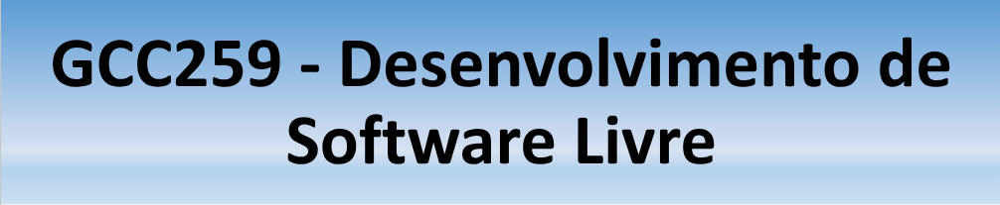

# 👤 Sobre Mim

## **Nome:** Mariana Sales 
**Email:** mariana.sales2@estudante.ufla.br

---

## 🎓 **Formação Acadêmica**
- *Bacharelado em Ciência da Computação* - Universidade Federal de Lavras (2022 - 2026)

---

## 💼 **Experiência Profissional**
- **Engenheira de Software Trainee** na Empresa LEVTY (2024 - atual)

---

## 🧠 **Habilidades**
- Linguagens: C++, Python, JavaScript, Java  
- Frameworks: React, Flask  
- Ferramentas: Git, GitHub, VSCode, Jira

---

